# OpenAnt — Design Document

> A robust, end-to-end design reference for OpenAnt's two-stage SAST pipeline.
> Every claim, file path, and module reference here is grounded in the live code in
> this repo (`apps/openant-cli/`, `libs/openant-core/`).
>
> **Scope:** architecture, data flow, AI/deterministic boundaries, file artifacts,
> per-stage internals, and cost-control invariants.
>
> **Audience:** engineers extending OpenAnt (new languages, new stages, new prompts),
> reviewers, integrators, and ops/oncall.

---

## 1. Goals & Non-Goals

### 1.1 Goals

1. **Find real, exploitable vulnerabilities** in source code repos with low false-positive rates.
2. **Optimize LLM cost** via deterministic pre-filters (entry-point reachability, CodeQL, classification).
3. **Stay language-agnostic** at the orchestration layer; languages plug in via a uniform parser contract.
4. **Be auditable**: every step writes a structured `*.report.json` artifact with timing, cost, and I/O.
5. **Separate "what" from "how"**: deterministic code defines the structure of analysis; LLMs make
   semantic judgments (does this code have a bug, is this exploitable, etc.).

### 1.2 Non-Goals

- OpenAnt does **not** patch code. It produces findings, not fixes.
- It is **not** a runtime monitor — it is static analysis with optional Docker-based dynamic verification.
- It does **not** replace CodeQL — CodeQL is used as a *pre-filter* in the `codeql` and `exploitable` levels.

---

## 2. Top-Level Architecture

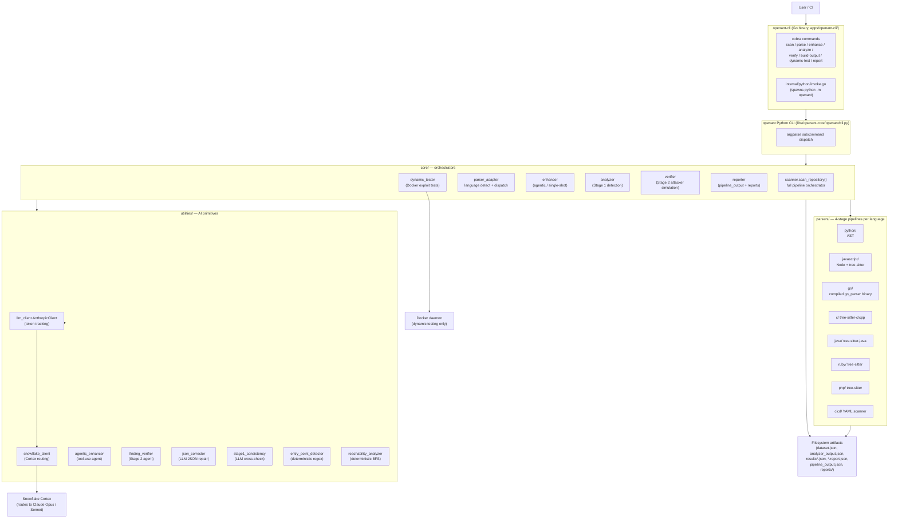

### 2.1 Two-Process Model

OpenAnt is split into two processes:

| Process | Language | Job |
|---------|----------|-----|
| `openant` (Go binary) | Go (cobra) | TTY UX, colored output, JSON envelope parsing, credential injection, project state in `~/.openant/` |
| `python -m openant` | Python | All pipeline logic — parsers, LLM calls, file I/O |

The Go binary is a thin wrapper. It:

1. Locates a Python 3.11+ runtime (managed venv at `~/.openant/venv/` or system Python). See
   `apps/openant-cli/internal/python/runtime.go`.
2. Injects `SNOWFLAKE_PAT`, `SNOWFLAKE_ACCOUNT`, `SNOWFLAKE_USER` into the subprocess environment.
3. Spawns `python -m openant <subcommand> <args>`. See
   `apps/openant-cli/internal/python/invoke.go`.
4. Streams stderr to the terminal (live progress) and parses stdout as a JSON envelope:

   ```json
   { "status": "success" | "error", "data": {...}, "errors": [...] }
   ```

5. Renders human output (or passes JSON through with `--json`) and propagates the exit code:

   - `0` — clean
   - `1` — vulnerabilities found / confirmed
   - `2` — error

This split keeps all the parsing/analysis complexity in Python while letting the user-facing CLI
be a fast, statically-linked Go binary.

---

## 3. Pipeline Stages — End-to-End

The `scan` command runs the full pipeline. Each stage can also be invoked standalone (`openant parse`,
`openant analyze`, etc.).

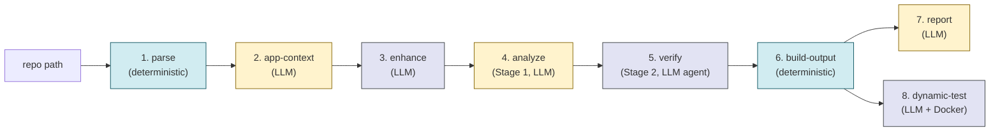

| # | Stage | File | Deterministic | AI |
|---|-------|------|---------------|----|
| 1 | parse | `core/parser_adapter.py` + `parsers/<lang>/` | ✅ all | none |
| 2 | app-context | `context/application_context.py` | file gathering | classify app type |
| 3 | enhance | `core/enhancer.py` → `utilities/context_enhancer.py` or `agentic_enhancer/` | scaffolding | per-unit classification (agentic loop) |
| 4 | analyze (Stage 1) | `core/analyzer.py` → `experiment.analyze_unit` | prompt assembly + JSON parsing | per-unit verdict |
| 5 | verify (Stage 2) | `core/verifier.py` → `utilities/finding_verifier.py` | tool dispatch | attacker-simulation agent |
| 6 | build-output | `core/reporter.build_pipeline_output` | ✅ all | none |
| 7 | report | `core/reporter.py` → `report/generator.py` | structure | summary + disclosure prose |
| 8 | dynamic-test | `core/dynamic_tester.py` → `utilities/dynamic_tester/` | Docker exec, retry loop | test generation prompts |

Each stage writes `{stage}.report.json` to the output dir via `core/step_report.py:step_context`. A
final `scan.report.json` aggregates them. This is what makes runs auditable.

---

## 4. Stage 1 — Parse (Deterministic)

The parse stage is **100% deterministic**. No LLM is invoked. It produces two file artifacts that
the rest of the pipeline reads:

- `dataset.json` — the **list of analysis units** (one unit per function/method/route handler).
- `analyzer_output.json` — a **flat function index** keyed by `func_id`, used as a tool-use repository
  index in Stage 2.

### 4.1 Language Detection & Dispatch

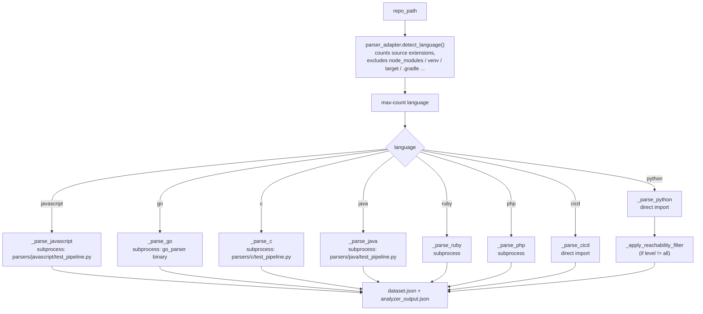

Each parser is a 4-stage subpipeline (Stage1 → Stage4 inside the parser). The Java parser is a good
canonical example since it was added recently and follows the cleanest version of the contract.

### 4.2 The Per-Language 4-Stage Parser Contract

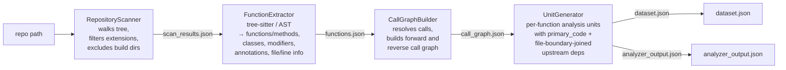

#### Stage 1 — `RepositoryScanner`

- Walks the tree under `repo_path`.
- Excludes language-specific build / vendor dirs (`node_modules`, `__pycache__`, `target`, `.gradle`,
  `.mvn`, `.git`, etc.).
- Optionally drops test files (`test_*.py`, `*Test.java`, `src/test/*`, etc.) when `--skip-tests` is on
  (default).
- Output: `scan_results.json` — `{files: [{path, size}], statistics: {...}}`.

#### Stage 2 — `FunctionExtractor`

Implementation strategies:

| Language | Strategy |
|----------|----------|
| Python   | `ast` module |
| JavaScript / TypeScript | `parsers/javascript/typescript_analyzer.js` (tree-sitter via Node) |
| Go | compiled `go_parser` binary |
| C/C++, Java, Ruby, PHP | tree-sitter (per-language grammar) |

Common output schema (per function):

```python
{
  "id": "<file_path>:<ClassName>.<methodName>#<arity>",  # arity for Java/C++ overloads
  "name": "...",
  "code": "<full source>",
  "unit_type": "main|route_handler|test|method|...",     # canonical classification
  "is_static": bool,
  "is_constructor": bool,
  "modifiers": [...],
  "annotations": [...],     # Java
  "decorators": [...],      # Python / mirror for Java annotations
  "file_path": "...",
  "start_line": int,
  "end_line": int,
  "class_name": "ClassName",
  "fully_qualified_name": "pkg.ClassName.methodName",  # Java
}
```

`unit_type` drives downstream classification, including which functions become entry points.
Common values:

- `main` — `public static void main(String[])` / `func main()` / `if __name__ == "__main__"` etc.
- `route_handler` — Spring (`@GetMapping`, `@RequestMapping`), JAX-RS (`@Path`), Flask (`@app.route`),
  FastAPI, Express handlers, Servlet API.
- `test` — JUnit `@Test`, pytest, Mocha, etc. (excluded by default).
- `constructor`, `static_initializer`, `abstract_method`, `native_method`, `static_method`,
  `private_method`, `method`.

#### Stage 3 — `CallGraphBuilder`

For every function, resolve its outgoing calls into `func_id`s of other extracted functions. The
resolution heuristics differ by language but always produce the same shape:

```python
{
  "functions": {func_id: {...metadata..., "code": "..."}},
  "call_graph":         {func_id: [callee_func_ids]},
  "reverse_call_graph": {func_id: [caller_func_ids]},
  "statistics": {"total_edges": N, ...}
}
```

Java-specific resolution (see `parsers/java/call_graph_builder.py`):

1. Resolve `method_invocation`, `object_creation_expression` (constructor calls), and
   `explicit_constructor_invocation` (`this(...)`/`super(...)`).
2. Lookup precedence: same-class → superclass chain → import-based → unique-name fallback.
3. A `JAVA_BUILTINS` denylist (`add`, `size`, `equals`, `println`, …) is consulted **after** local
   resolution so that a local `Calculator.add(...)` correctly shadows `Collection.add()`.

The persisted `call_graph.json` is critical — it is what `core/parser_adapter._apply_reachability_filter`
reads to compute the reachability set.

#### Stage 4 — `UnitGenerator`

Produces the analysis units consumed by the AI stages. Each unit has:

- `id` — same as `func_id`.
- `unit_type` — for entry-point classification.
- `code.primary_code` — the function body, optionally followed by upstream deps separated by
  `// ========== File Boundary ==========` (or language-appropriate marker). The marker is required
  so Stage 1 / Stage 2 prompts can split out the target function from its context (see
  `prompts/vulnerability_analysis.py:120`).
- `code.primary_origin` — `{file_path, function_name, class_name, files_included, enhanced}`.
- `metadata.direct_calls` — outgoing edges.
- `metadata.direct_callers` — incoming edges.

`analyzer_output.json` is the same data flattened into a function-keyed dict — used by
`utilities/agentic_enhancer/repository_index.RepositoryIndex` so Stage 2's tool-use agent can
search the codebase by function name / file path.

### 4.3 Processing Levels — The Cost Lever

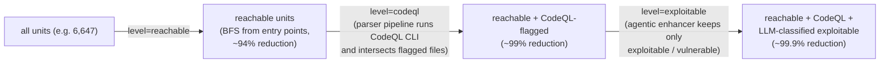

| Level | Filter | Where applied |
|-------|--------|----|
| `all` | none | — |
| `reachable` | entry-point reachability (deterministic BFS) | `core/parser_adapter._apply_reachability_filter` (Python) and per-parser `apply_reachability_filter` (JS/Go/C/Java/Ruby/PHP) |
| `codeql` | reachable + CodeQL pre-filter | per-parser `run_codeql_analysis` invokes `codeql database create` + `analyze` and intersects flagged units |
| `exploitable` | reachable + CodeQL + LLM `agent_context.security_classification ∈ {exploitable, vulnerable}` | agentic enhancer assigns the classification; the next stage (`analyze --exploitable-only`) filters down to it |

The reachable filter is purely structural; CodeQL is purely structural; only the final
`exploitable` step uses an LLM (and it's the **agentic enhancer**, not a separate pass).

---

## 5. Stage 2 — Application Context (LLM, file-grounded)

`context/application_context.py:generate_application_context`

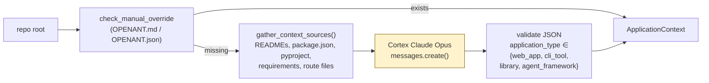

**Why this stage exists:** the same code pattern is a **vulnerability** in a web app and a
**feature** in a CLI tool. Path traversal in a CLI is not a security issue — the user already has
filesystem access.

The LLM produces a structured `ApplicationContext` (frozen dataclass) with fields like
`intended_behaviors`, `not_a_vulnerability`, `requires_remote_trigger`. Every later prompt
(`vulnerability_analysis.py`, `verification_prompts.py`) injects this so the model knows what
*not* to flag.

If `application_type` is not in the supported set the run fails with exit code 2 — by design,
because a wrong app type would silently invalidate the entire run.

---

## 6. Stage 3 — Enhance (Hybrid)

`core/enhancer.enhance_dataset` runs in one of two modes:

### 6.1 Single-shot mode (cheap, fast)

`utilities/context_enhancer.ContextEnhancer.enhance_dataset`

- One prompt per unit, no tool use.
- Uses `claude-sonnet-4-6` (default).
- Adds `unit["llm_context"]` with `missing_dependencies`, `additional_callers`, `data_flow`,
  `imports`, `confidence`.
- Useful when reachability already pruned aggressively and we just want better dependency
  resolution.

### 6.2 Agentic mode (default, thorough)

`utilities/agentic_enhancer/agent.ContextAgent.analyze_unit`

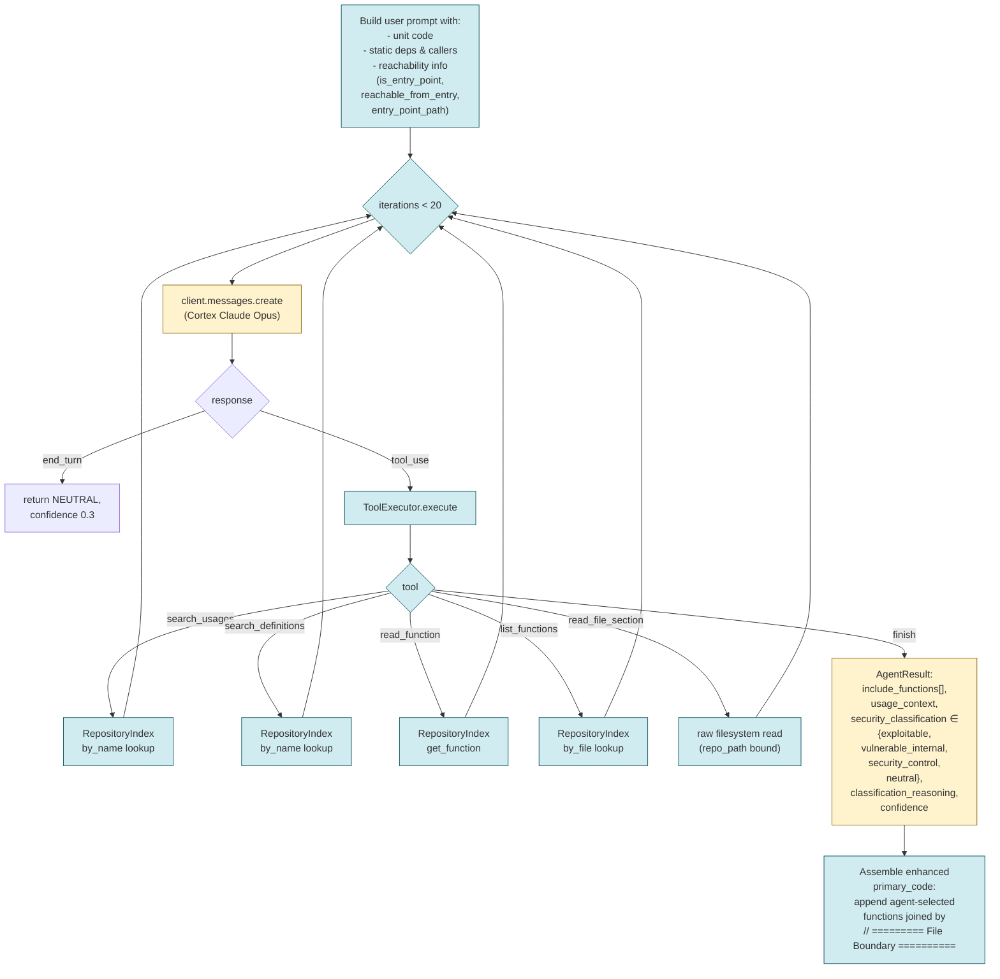

Key invariants:

- **Tool dispatch is deterministic.** The agent decides *which* tool to call; the
  `ToolExecutor` (`utilities/agentic_enhancer/tools.py:ToolExecutor`) executes it against the
  in-memory `RepositoryIndex` (and bounded filesystem reads). The model never executes code.
- **Hard iteration limit.** `MAX_ITERATIONS = 20` (`agent.py:32`). If the agent doesn't call
  `finish`, the unit is classified `neutral` with confidence 0.3 — never silently passed.
- **Reachability is a *prompt* input, not a verdict gate.** The agent gets `is_entry_point`,
  `reachable_from_entry`, and the call path so its classification can be reachability-aware
  (`prompts.py:get_user_prompt`).
- **Checkpoint / resume.** `enhance_dataset_agentic` writes a checkpoint after each unit when
  `--checkpoint` is set, so an aborted run can be resumed without re-paying for processed units.
- **Output:** `unit["agent_context"] = AgentResult.to_dict()` and (optionally) extended
  `primary_code` with append-joined deps.

---

## 7. Stage 4 — Stage 1 Detection (LLM, single-shot)

`core/analyzer.run_analysis` → `experiment.analyze_unit`

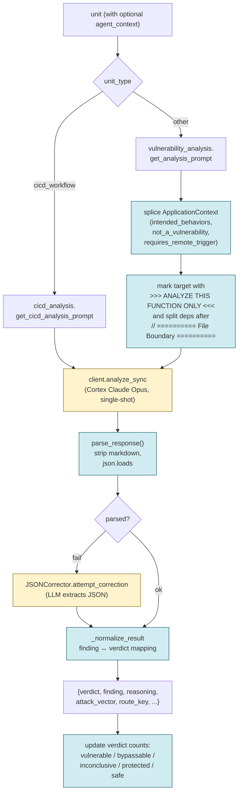

### 7.1 Prompt design

**System prompt** (`prompts/vulnerability_analysis.STAGE1_SYSTEM_PROMPT`):

> "You are a security analyst. Analyze code for real vulnerabilities. Be skeptical. Most code is
> not vulnerable. Only flag something as VULNERABLE if you can: (1) Construct a specific attack
> payload, (2) Show exactly how it reaches a dangerous operation, (3) Explain what unauthorized
> capability an attacker gains. If you can't do all three, it's probably not vulnerable."

**User prompt** asks 4 questions and then a JSON-only response:

1. What does this code do?
2. Where does input come from? (modulated by ApplicationContext)
3. If you think there's a vulnerability, prove it.
4. Could you be wrong?

**Output schema:**

```json
{
  "function_analyzed": "...",
  "finding": "safe | protected | vulnerable | inconclusive",
  "reasoning": "...",
  "attack_vector": "...",
  "confidence": 0.0
}
```

### 7.2 Stage 1 consistency check (deterministic + LLM)

After Stage 1 finishes, `utilities/stage1_consistency.run_stage1_consistency_check` groups
findings by code-pattern similarity (cross-file). For groups with conflicting verdicts, an Opus
LLM call decides whether they should be unified — and if yes, which findings to update. This
catches things like "same `httpx` client wrapped for OpenAI vs Anthropic should have the same
verdict" patterns (file-level grouping in Stage 2 alone wouldn't catch this).

The output is `results.json`:

```json
{
  "dataset": "...",
  "model": "claude-opus-4-6",
  "metrics": {"total": N, "vulnerable": ..., "safe": ..., ...},
  "results": [{"unit_id", "verdict", "finding", "reasoning",
               "attack_vector", "route_key", "elapsed_seconds",
               "stage1_consistency_update": {...}?}],
  "code_by_route": {route_key: code}
}
```

`code_by_route` is persisted **specifically** so Stage 2 doesn't have to re-resolve unit code.

---

## 8. Stage 5 — Stage 2 Verification (LLM agent with attacker simulation)

`core/verifier.run_verification` → `utilities/finding_verifier.FindingVerifier`

This is OpenAnt's **secret weapon** for false-positive reduction. Instead of asking the model "is
this still vulnerable?" (which biases toward "yes" because the question implies it should be), we
flip the framing entirely: the model **role-plays as an attacker on the internet with only a
browser** and tries to exploit the vulnerability step-by-step.

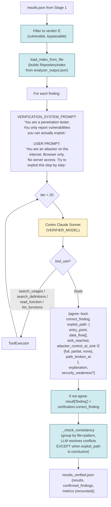

### 8.1 Why attacker simulation works

The model naturally hits roadblocks it would have rationalized away when asked abstractly:

- "OK, I'll send `; rm -rf /` as the URL... wait, this endpoint requires auth. I don't have
  credentials. The `attacker_control_at_sink` is `none` — `path_broken_at: 'auth middleware'`."
- "I'd inject `<script>` here... but the framework auto-escapes. `sink_reached: false`."

The reported per-component design metric: **0 false positives on object-browser** (25 units
analyzed) — see `CLAUDE.md`. The structured `exploit_path` field is the receipt: every confirmed
finding ships with the data flow trace.

### 8.2 Conclusive exploit path protection

`FindingVerifier._has_conclusive_exploit_path` ensures the consistency check **does not** override
findings whose exploit-path analysis is conclusive (e.g., `sink_reached=false`). This prevents a
careful per-finding analysis from being clobbered by superficial cross-pattern matching.

---

## 9. Stage 6 — Build Pipeline Output (Deterministic)

`core/reporter.build_pipeline_output`

A pure data transform from `results.json` / `results_verified.json` into the canonical
`pipeline_output.json` schema consumed by reports + dynamic testing:

```jsonc
{
  "repository": {"name", "url", "language", "commit_sha"},
  "analysis_date": "ISO 8601",
  "application_type": "web_app | cli_tool | ...",
  "pipeline_stats": {
    "total_units", "reachable_units", "units_analyzed",
    "processing_level",
    "costs": {"<step>": {"actual": <usd>}},
    "durations": {"<step>": <seconds>}
  },
  "results": {"vulnerable", "safe", "inconclusive", "total"},
  "findings": [
    {
      "id": "VULN-001",
      "name", "short_name",
      "location": {"file", "function"},
      "cwe_id", "cwe_name",
      "stage1_verdict", "stage2_verdict",  // confirmed | agreed | rejected
      "description", "vulnerable_code", "impact",
      "suggested_fix", "steps_to_reproduce"
    }
  ]
}
```

This is the single artifact downstream tools (reporter, dynamic tester, integrators) consume.

---

## 10. Stage 7 — Reports (LLM)

`core/reporter` dispatches by `--format`:

| Format | LLM? | Generator |
|--------|------|-----------|
| `html` | no | `generate_report.py` (Chart.js) |
| `csv` | no | `export_csv.py` |
| `summary` | yes | `report/generator.generate_summary_report` (Sonnet) |
| `disclosure` | yes | `report/generator.generate_disclosure_docs` (Sonnet, one doc per finding) |

The LLM-driven reports take the **compacted** `pipeline_output.json` (large fields stripped via
`_compact_for_summary`) and produce Markdown using prompt templates from `report/prompts/`. This
is the only place the LLM produces **prose for humans**, not structured verdicts.

---

## 11. Stage 8 — Dynamic Test (Hybrid: LLM + Docker)

`core/dynamic_tester.run_tests` → `utilities/dynamic_tester/__init__.run_dynamic_tests`

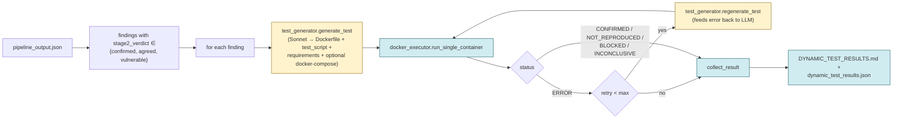

Key invariants:

- **Tests run only inside Docker.** No host access. The system prompt
  (`utilities/dynamic_tester/test_generator.SYSTEM_PROMPT`) explicitly forbids host assumptions.
- **CWE-specific guidance.** `_get_cwe_guidance` tailors the prompt for known classes (CWE-22, 78,
  79, 89, 94, 134, 200, 502, 918) so the test attempts the *right* exploit shape.
- **Attacker capture server.** For SSRF / callback / exfiltration tests, a local capture server
  on port 9999 is wired in via `docker-compose` so the test can verify outbound network IO.
- **Self-healing retry loop.** When a test fails to *build or run* (compile errors, missing deps,
  etc.), the failure stderr is fed back to the LLM in `regenerate_test` for up to `max_retries`
  iterations. This is **not** a re-classification of the verdict — it's purely fixing the test's
  own bugs.
- **Output:**
  - `DYNAMIC_TEST_RESULTS.md` — human readable.
  - `dynamic_test_results.json` — machine readable; `status ∈ {CONFIRMED, NOT_REPRODUCED, BLOCKED, INCONCLUSIVE, ERROR}`.

---

## 12. AI ↔ Deterministic Boundary — The Master Map

| Step | What's deterministic | What's AI |
|------|---------------------|-----------|
| Language detection | extension counting + dir exclusion | — |
| File scanning | `glob` walk + exclude lists | — |
| Function extraction | tree-sitter / AST grammar parsing | — |
| Call graph resolution | name lookup + scope rules + heuristics | — |
| Entry-point detection | `unit_type` set + decorator/annotation regex + code regex (`request.body`, `sys.argv`, …) | — |
| Reachability filter | BFS over reverse call graph | — |
| CodeQL filter | shell out to `codeql database create / analyze`; parse SARIF | — |
| App context | gather README / pyproject / package.json | classify into `web_app/cli_tool/library/agent_framework` |
| Enhance (single-shot) | prompt template + JSON parse | identify missing deps, callers, data flows |
| Enhance (agentic) | tool dispatch + repo index + iteration cap + reachability annotations | tool selection, classification, confidence |
| Stage 1 detect | prompt assembly + AppContext splice + JSON parse + `parse_response` + verdict-name normalization | verdict + reasoning + attack vector |
| JSON correction | call this only when `parse_response` fails | re-extract JSON from malformed LLM response |
| Stage 1 consistency | pattern grouping (regex on signatures) | cross-file equivalence check |
| Stage 2 verify | tool dispatch + iteration cap + exploit-path field validation | attacker simulation, exploit path |
| Stage 2 consistency | group by file + pattern; protect conclusive exploit paths | resolve verdict conflicts |
| Build pipeline_output | pure JSON transform | — |
| HTML/CSV report | template renderer | — |
| Summary / disclosure | prompt template injection | prose generation |
| Test generator | parse JSON response | Dockerfile + test script |
| Test executor | Docker run + stderr capture + retry | — |
| Test regenerator | error-feedback prompt template | fixed Dockerfile / test |

---

## 13. LLM Plumbing & Cost Tracking

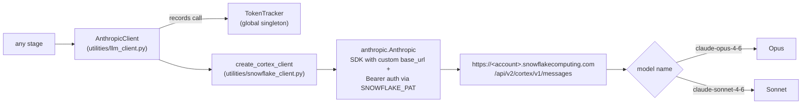

### 13.1 No direct Anthropic calls

OpenAnt **does not call api.anthropic.com directly**. Every LLM call routes through Snowflake
Cortex via `utilities/snowflake_client.create_cortex_client`. The Anthropic Python SDK is used
because it speaks the same wire protocol — only the `base_url` and auth header are swapped.

This means:

- Auth uses a Snowflake **PAT** (`SNOWFLAKE_PAT`), not an Anthropic key. The `ANTHROPIC_API_KEY`
  string in `AnthropicClient.__init__` is `"not-used"`.
- The active models are `claude-opus-4-6` and `claude-sonnet-4-6` (Snowflake naming) — see
  `MODEL_NAME_MAP`.

### 13.2 Per-step cost capture

`core/step_report.step_context` snapshots the global tracker before and after each step, so
`{step}.report.json` always carries the *delta* cost and tokens for that step alone:

```json
{
  "step": "analyze",
  "duration_seconds": 124.2,
  "cost_usd": 1.4530,
  "token_usage": {"input_tokens": 1023405, "output_tokens": 12480, "total_tokens": 1035885},
  "inputs": {...},
  "outputs": {...},
  "summary": {...}
}
```

This is the unit cost data the budget gates use in autopilot mode.

### 13.3 Model selection per stage

| Stage | Hard-coded model | How it's set | Rationale |
|-------|------------------|--------------|-----------|
| App context | Opus | `application_context.py:472` (`model="claude-opus-4-6"`) | one-time, must be right |
| Enhance — agentic | **Opus** (hard-coded) | `agentic_enhancer/agent.py:29` (`AGENT_MODEL`) — *ignores* CLI `--model` flag | classification is high-leverage |
| Enhance — single-shot | configurable | `core/enhancer.py:43` (`--model` flag, default `sonnet` → Sonnet) | cheap mode |
| Stage 1 detection | configurable | `core/analyzer.py:76` (`--model` flag, default `opus`) | per-unit, verdict is high-leverage |
| Stage 2 verification | **Sonnet** (hard-coded) | `finding_verifier.py:62` (`VERIFIER_MODEL`) | tool-use exploration is iteration-heavy; Sonnet keeps cost reasonable |
| Stage 1 consistency | **Opus** (hard-coded) | `stage1_consistency.py:22` (`CONSISTENCY_MODEL`) | accuracy critical, runs only on conflict groups |
| JSON correction | inherited | uses caller's `AnthropicClient` instance | runs only when JSON parse fails |
| Test generation / regeneration | **Sonnet** (hard-coded) | `dynamic_tester/test_generator.py:15` (`SONNET_MODEL`) | code generation, well-suited to Sonnet |
| Summary / disclosure | **Sonnet** (hard-coded) | `report/generator.py:19` (`MODEL`) | prose generation |

---

## 14. File Artifacts — Single Source of Truth

```
output_dir/
├── dataset.json               # parse output: list of analysis units
├── analyzer_output.json       # parse output: function index for tool use
├── call_graph.json            # parse intermediate: forward + reverse call graph
├── application_context.json   # app-context output
├── dataset_enhanced.json      # enhance output: dataset + agent_context per unit
├── results.json               # Stage 1 output: per-unit verdicts + code_by_route
├── results_verified.json      # Stage 2 output: + verification + confirmed_findings
├── pipeline_output.json       # canonical bridge format for reports + dyntest
├── parse.report.json
├── app-context.report.json
├── enhance.report.json
├── analyze.report.json
├── verify.report.json
├── build-output.report.json
├── report.report.json
├── dynamic-test.report.json
├── scan.report.json           # aggregate for the whole run
├── codeql-db/                 # only for level=codeql / exploitable
├── codeql-results.sarif
├── report/
│   ├── SUMMARY_REPORT.md
│   └── disclosures/
│       └── VULN-001.md ...
├── DYNAMIC_TEST_RESULTS.md
└── dynamic_test_results.json
```

Two design rules:

1. **Every stage reads only from files written by previous stages.** No global state, no DB. This
   is why every stage is also runnable standalone.
2. **Every stage writes a `*.report.json`.** No "did this run finish?" guesswork — the artifact
   tree *is* the run state.

---

## 15. Adding a New Language — Reference Procedure

To add a new language (e.g., Rust):

1. **Create `parsers/rust/`** with the four required modules:
   - `repository_scanner.py` — find `.rs` files, exclude `target/`.
   - `function_extractor.py` — tree-sitter-rust → functions, structs, methods.
   - `call_graph_builder.py` — resolve call expressions; respect trait dispatch heuristics.
   - `unit_generator.py` — emit `dataset.json` + `analyzer_output.json` with file boundary
     markers.
   - `test_pipeline.py` — orchestrator with the same `--processing-level` contract; runs
     `RepositoryScanner → FunctionExtractor → CallGraphBuilder → UnitGenerator → CodeQL?`.
2. **Wire it into `core/parser_adapter.py`:**
   - Add `"rust": 0` to the `counts` dict in `detect_language`.
   - Add the `.rs` suffix branch.
   - Add a `_parse_rust` dispatcher that subprocesses the parser script.
3. **Update CLI choices:**
   - `apps/openant-cli/cmd/parse.go` (`--language` flag).
   - `apps/openant-cli/cmd/scan.go` (`--language` flag).
   - `libs/openant-core/openant/cli.py` (`scan_p` and `parse_p` argparse choices).
4. **Update `EntryPointDetector` if needed:**
   - Add language-specific decorator regexes (e.g., `#[get(...)]` for actix-web) to
     `ENTRY_POINT_DECORATORS` in `utilities/agentic_enhancer/entry_point_detector.py`.
   - Or normalize to `unit_type: "route_handler"` in your `function_extractor`.
5. **Add `tree-sitter-rust` to `requirements.txt` and `pyproject.toml`.**
6. **Smoke test** with the existing 4 processing levels on a small target.

The Java parser (`parsers/java/`) is the cleanest reference implementation.

---

## 16. Failure Modes & Invariants

### 16.1 Hard limits

| Limit | Where | Why |
|-------|-------|-----|
| `MAX_ITERATIONS = 20` per agent unit | `agent.py`, `finding_verifier.py` | bound runaway tool-use loops |
| `MAX_TOKENS_PER_RESPONSE = 4096` | `agent.py`, `finding_verifier.py` | ensure JSON fits |
| `subprocess timeout=1800` (30 min) per parser run | `parser_adapter._parse_*` | bound wedged parsers |
| `60s` Docker test timeout | dynamic test system prompt | prevent hanging containers |
| Reachability max depth 15 | `reachability_analyzer.py:49` | prevent infinite cycle traversal |
| Iteration on agent end_turn without `finish` | `agent.py:207` | falls back to `neutral` / 0.3 confidence |

### 16.2 Failure handling

- **JSON parse failure in Stage 1** → `JSONCorrector` retry; if still bad, the unit is recorded
  with `verdict: ERROR` and counted in `metrics.errors`. The pipeline does not abort.
- **Parser subprocess non-zero exit** → `RuntimeError` raised, surfaces as `status: error`
  envelope from the CLI.
- **Missing `analyzer_output.json` for Stage 2** → `FileNotFoundError` (Stage 2 cannot do tool-use
  without it).
- **Docker not installed for `dynamic-test`** → `RuntimeError` from `core/dynamic_tester.run_tests`.
- **Verify with no findings** → Stage 2 short-circuits: writes empty verified results, no LLM
  calls. Cost is $0.
- **Unsupported `application_type`** → run fails with exit code 2 (intentional — wrong app type
  invalidates everything downstream).

### 16.3 Idempotency

The agentic enhancer is the only stage that supports **checkpoint/resume**: pass `--checkpoint`
and a per-unit JSON checkpoint file is rewritten after each unit. Re-running the command picks up
where it left off, skipping units whose `agent_context` is already populated and not in error.

Other stages are not checkpointed — they're either fast (parse, build-output) or already
parallelizable per-unit (analyze, verify), and a redo is just `rm output_dir && rerun`.

---

## 17. Key Code Pointers

| Concept | File |
|---------|------|
| Go CLI dispatch | `apps/openant-cli/cmd/scan.go` (and siblings) |
| Python subprocess invocation | `apps/openant-cli/internal/python/invoke.go` |
| Argparse + JSON envelope | `libs/openant-core/openant/cli.py` |
| Full-pipeline orchestrator | `libs/openant-core/core/scanner.py` |
| Per-stage step report | `libs/openant-core/core/step_report.py` |
| Language detect & dispatch | `libs/openant-core/core/parser_adapter.py` |
| 4-stage parser per language | `libs/openant-core/parsers/<lang>/` |
| Application context generation | `libs/openant-core/context/application_context.py` |
| Single-shot enhancer | `libs/openant-core/utilities/context_enhancer.py` |
| Agentic enhancer agent loop | `libs/openant-core/utilities/agentic_enhancer/agent.py` |
| Agent tool definitions | `libs/openant-core/utilities/agentic_enhancer/tools.py` |
| Entry-point detection | `libs/openant-core/utilities/agentic_enhancer/entry_point_detector.py` |
| Reachability BFS | `libs/openant-core/utilities/agentic_enhancer/reachability_analyzer.py` |
| Repository index for tool use | `libs/openant-core/utilities/agentic_enhancer/repository_index.py` |
| Stage 1 prompts | `libs/openant-core/prompts/vulnerability_analysis.py` |
| Stage 2 prompts | `libs/openant-core/prompts/verification_prompts.py` |
| Stage 1 detection wrapper | `libs/openant-core/core/analyzer.py` (calls `experiment.analyze_unit`) |
| Stage 2 verification wrapper | `libs/openant-core/core/verifier.py` (calls `FindingVerifier`) |
| Stage 2 verifier | `libs/openant-core/utilities/finding_verifier.py` |
| JSON correction | `libs/openant-core/utilities/json_corrector.py` |
| Stage 1 consistency | `libs/openant-core/utilities/stage1_consistency.py` |
| Pipeline output schema | `libs/openant-core/core/reporter.py:build_pipeline_output` |
| LLM client | `libs/openant-core/utilities/llm_client.py` |
| Cortex routing | `libs/openant-core/utilities/snowflake_client.py` |
| Dynamic test orchestrator | `libs/openant-core/utilities/dynamic_tester/__init__.py` |
| Test generation prompt | `libs/openant-core/utilities/dynamic_tester/test_generator.py` |
| Docker executor | `libs/openant-core/utilities/dynamic_tester/docker_executor.py` |
| Summary / disclosure prose | `libs/openant-core/report/generator.py` |

---

## 18. Glossary

- **Unit** — one analysis target. Usually a function or method, sometimes a CI/CD workflow or
  module-level Python script. Identified by `func_id` (e.g.,
  `src/main/java/com/example/Greeter.java:Greeter.greet#1`).
- **Entry point** — a unit that directly receives untrusted input. Detected deterministically by
  `EntryPointDetector` from `unit_type`, decorators/annotations, or input-source code patterns.
- **Reachable** — a unit `f` is reachable iff there is a path in the call graph from some entry
  point to `f` (BFS forward over the forward call graph, equivalently BFS backward from `f` over
  the reverse call graph).
- **Stage 1** — single-shot LLM detection. Produces `verdict ∈ {vulnerable, bypassable, safe,
  protected, inconclusive}`.
- **Stage 2** — agentic LLM verification. Role-plays as an attacker, traces the exploit path,
  produces `agree: bool` + structured `exploit_path`.
- **Confirmed finding** — Stage 1 said vulnerable AND Stage 2 agreed AND `exploit_path` is
  populated. This is what gets written to `confirmed_findings` in `results_verified.json`.
- **Pipeline output** — the canonical `pipeline_output.json` artifact bridging analysis to
  reports / dynamic testing.
